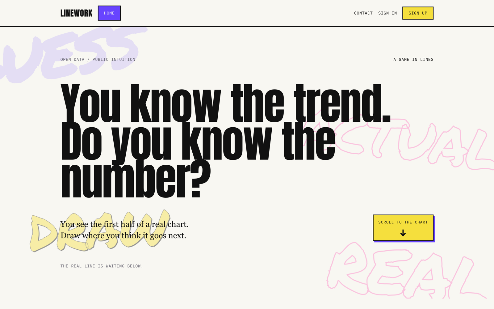
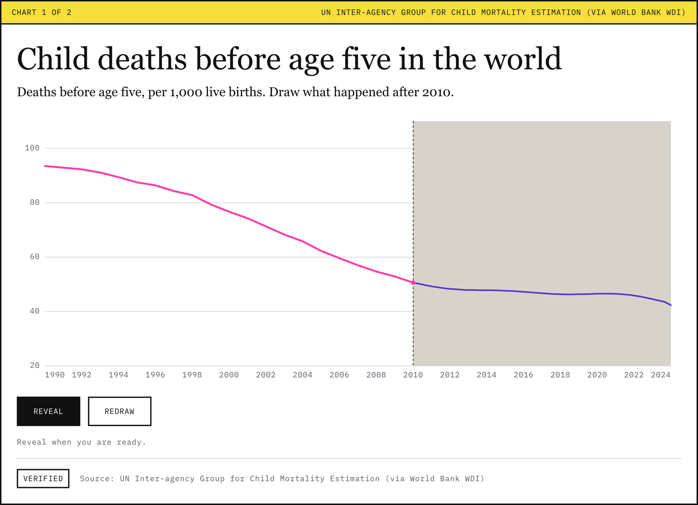
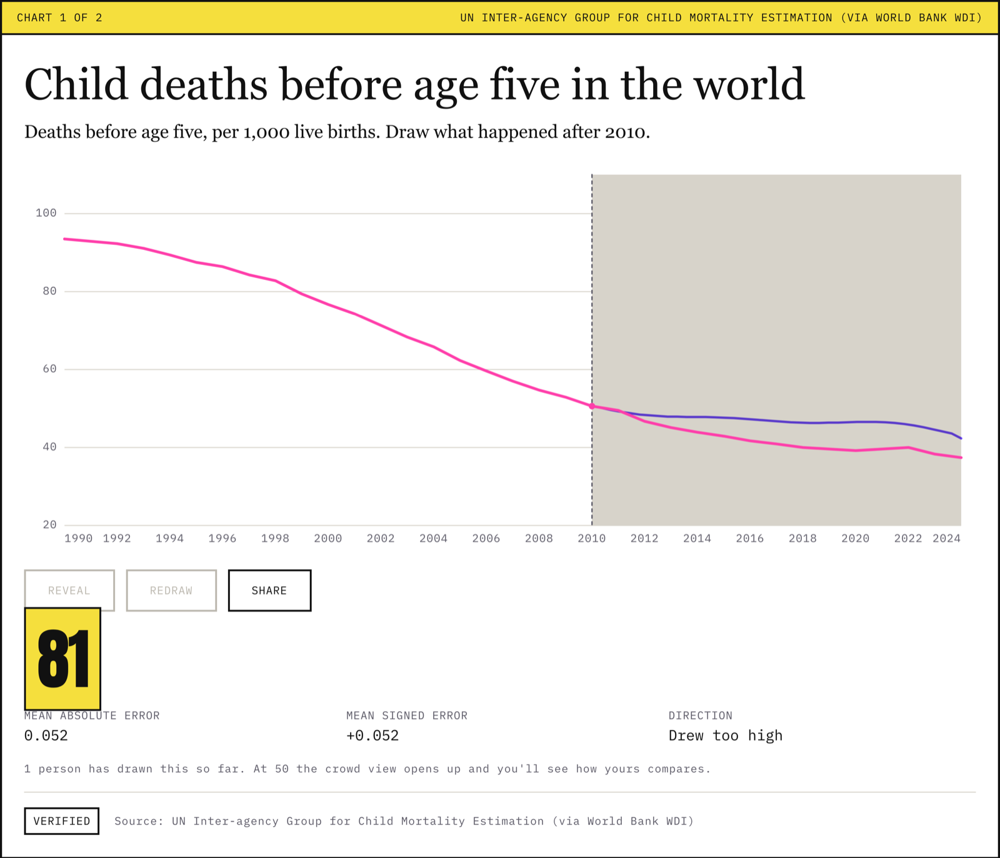

<div align="center">

# Linework

### You know the trend. Do you know the number?

Linework shows you the first half of a real chart and asks you to draw the
rest. Then the truth draws itself over your line.

**[linework.cc](https://linework.cc)**

</div>

<br>



<br>

## What it is

Every chart is a real, sourced time series. You see the beginning of it, drag
to draw where you think it went next, and then the real line appears on top of
your guess with a score.

Being wrong is the point. **Every drawn line is stored**, and at scale that
becomes something more useful than a game: a structured record of where public
intuition diverges from measured reality, question by question and year by
year.

The game is the collection instrument. The data is the output.

<br>

<table>
<tr>
<td width="50%" valign="top">

**You draw the continuation**



</td>
<td width="50%" valign="top">

**The truth draws itself over it**



</td>
</tr>
</table>

That example is the whole thesis in one frame. Global child mortality roughly
halved between 2010 and 2024. The drawn line follows the right direction and
still lands well short, which is the pattern this project exists to measure:
people tend to know which way a trend went and badly underestimate how far.

<br>

## How the measurement works

Each drawn line is resampled to 40 evenly spaced points and stored as integers
quantised to 0–1000, normalised against that chart's y-axis. The real series is
resampled onto the same 40 positions before anything is compared, since the
source data has one point per year and a drawn path always has 40.

```
meanAbsError    = mean(|guess − truth|)      how wrong
meanSignedError = mean(guess − truth)        which direction
score           = round(100 · exp(−4 · meanAbsError))
```

`meanSignedError` is the column that matters. Absolute error says people are
wrong; signed error says whether they drew too high or too low, and a direction
that holds across many people is a claim about public belief rather than about
one person's aim.

Scores are computed server-side from the database's own copy of the series. The
client computes the same score locally so the reveal never waits on the network,
and the server's number silently replaces it if they disagree.

<br>

## Where the data comes from

Charts are imported from the World Bank's open API, which redistributes series
from the UN Population Division, WHO, UNICEF, UNODC, the IEA and others. Each
chart records the originating organisation rather than crediting everything to
the redistributor.

Every imported chart stores a reproducible series id such as
`worldbank:SP.DYN.LE00.IN:USA`, so re-running the importer reproduces the same
numbers. That is what the reliability rating asserts: not "this looks right"
but "here is how to check me."

Series with interior gaps, too few points, or a barely-moving drawable portion
are **rejected rather than repaired**. Interpolating across a gap would invent
values nobody measured, and a rejected series costs nothing while a repaired one
silently corrupts a finding.

<br>

## Honest limits

Worth stating plainly rather than burying:

- **The dataset is not yet large enough to publish anything.** The crowd view
  needs 50 clean responses for a single chart before it will render percentile
  bands at all, and below that threshold the API returns no percentiles for a
  client to accidentally display. [`FINDINGS.md`](FINDINGS.md) reports what the
  current sample actually supports, which is mostly that the instrument works.
- **Respondents are self-selected**, so this measures the beliefs of people who
  chose to play a chart game, not a representative population.
- **A drawn line is not a stated number.** It is a shape, and reading a belief
  out of it involves assumptions worth arguing with.

<br>

## Repository layout

| Path | What is in it |
|---|---|
| `app/` | Next.js App Router pages and API routes |
| `components/` | Chart rendering, the drawing surface, the state machine |
| `lib/` | Pure logic: scoring, resampling, geometry, streaks, crowd comparison |
| `lib/server/` | Database access, validation, rate limiting, moderation |
| `scripts/` | Dataset import, validation, seeding, the design guard |
| `supabase/migrations/` | Schema, constraints and the crowd aggregation job |
| `analysis/` | Read-only SQL for analysing collected responses |
| `docs/DESIGN.md` | The rules a change could break silently, and why they exist |
| `SCHEMA.md` | Every table, column and constraint, with the reasoning |
| `FINDINGS.md` | What the collected data currently supports |

<br>

## Running it locally

Requires Node 22+ and a Postgres database.

```bash
npm install
cp .env.example .env.local     # then fill in the values
npm run db:push                # apply migrations
npm run seed                   # load the chart catalogue
npm run dev
```

| Command | Does |
|---|---|
| `npm run dev` | Development server |
| `npm run dev:lan` | Binds `0.0.0.0`, reachable from a phone on the same wifi |
| `npm run build` | Validates the dataset catalogue, then builds |
| `npm test` | Unit tests for the pure modules |
| `npm run check` | Validation, design guard, tests and lint |

`npm run check` is the gate. It refuses to pass if any active chart is
unverified or missing a source, if a colour or font bypasses the token system,
or if any question text gives away its own answer.

<br>

## Built with

Next.js and React with TypeScript, Postgres via Supabase, Auth.js for accounts,
and Tailwind for layout only — every colour and spacing value flows through CSS
custom properties.

**No charting library.** Every chart is hand-built SVG, because the drawing
surface needs full manual control of its coordinate space. **No component
library.** Testing is `node:test` through Node's native TypeScript
type-stripping, so there are no test dependencies at all.

<br>

## Credit

The draw-then-reveal mechanic is the New York Times "You Draw It" format
(Gregor Aisch, Amanda Cox and Kevin Quealy, 2015), which also showed readers
how everyone else drew it. Linework is an independent project and is not
affiliated with or endorsed by the New York Times.

<br>

## License

No license has been chosen yet, so default copyright applies and the code is
not licensed for reuse. If you want to use part of it, please ask.

Chart data belongs to the originating organisations and is subject to their
terms; the World Bank's open data is published under CC BY 4.0.
